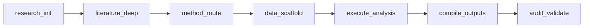

# Skill: Workflow DAG Visualization

## Purpose
Generate a visual representation of the entire research workflow as a directed acyclic graph, showing skill execution order and data flow.

## When to Use
- After analysis pipeline executed
- For reproducibility documentation
- Tracking research provenance

---

## Node Types

| Status | Color | Description |
|--------|-------|-------------|
| Completed | `#009E73` (green) | Successfully executed |
| Failed | `#D55E00` (vermillion) | Execution error |
| Skipped | `#999999` (gray) | Not applicable |
| Running | `#0072B2` (blue) | In progress |

## Layout

- **Direction**: Left-to-right (topological order)
- **Node size**: Proportional to execution time
- **Labels**: skill_id + status icon
- **Edges**: Dependency relationships

## Mermaid Export

Generate Mermaid.js flowchart syntax for embedding in markdown:

---

## Validation Checks
- [ ] Graph is acyclic
- [ ] All executed skills included
- [ ] Dependencies correctly represented
- [ ] Mermaid syntax validates
- [ ] Design system colors used
