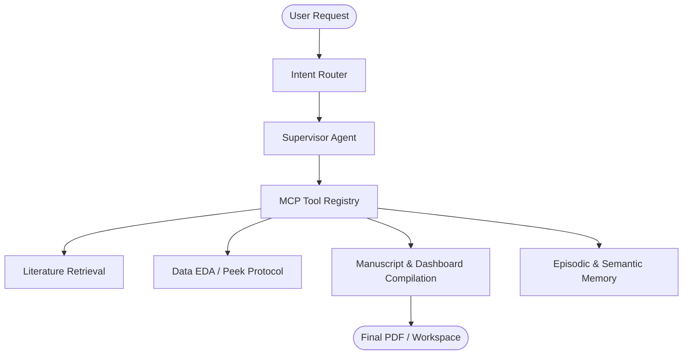

# Agentic Research OS

[](https://opensource.org/licenses/MIT)
[](https://www.python.org/downloads/)

> **The Elevator Pitch**: Agentic Research OS is a self-healing, citation-verified research engine that any LLM can operate — from raw data ingestion to a publication-ready PDF manuscript. By acting as a Model Context Protocol (MCP) server, it transforms your AI IDE (Cursor, Windsurf, Claude Desktop) into an autonomous academic researcher.


## Architecture



## Quickstart

1. **Clone the repository:**
   ```bash
   git clone https://github.com/VibhavSetlur/research-copilot.git agentic-research-os
   cd agentic-research-os
   ```

2. **Install dependencies:**
   ```bash
   # We recommend using `uv` for speed, but standard `pip` works too.
   pip install -e .[all]
   ```

3. **Configure Environment:**
   Copy `.env.example` to `.env` and add your API keys:
   ```bash
   cp .env.example .env
   # Edit .env to add OPENAI_API_KEY, ANTHROPIC_API_KEY, etc.
   ```

4. **Run the Pre-Flight Check:**
   Ensure everything is configured correctly:
   ```bash
   research-os doctor
   ```

5. **Run your first research task:**
   ```bash
   research-os run "Analyze the impact of interest rates on housing prices in 2023"
   ```

## Folder Structure (The Workspace Taxonomy)

Agentic Research OS forces a strict, reproducible folder taxonomy. When you run the OS, it creates a unified `workspace/` directory:

- `workspace/data/raw/` - Immutable input data.
- `workspace/data/derived/` - Cleaned/processed datasets.
- `workspace/figures/` - High-quality 300-DPI charts.
- `workspace/manuscript/` - Final LaTeX, Markdown, and PDF outputs.
- `workspace/logs/` - Execution logs and debugging trails.
- `workspace/.os_state/` - Internal memory and state ledger.
- `workspace/lab_notebook.md` - Your human-readable project journal. project operations). It provides a strict, rigid framework to stop LLMs from hallucinating file paths, generating poor code structures, and writing non-academic fluff.

## Features
- **Model Context Protocol (MCP)**: Run the OS securely within IDEs like Cursor via the MCP standard.
- **Strict Execution Pipelines**: Forces models to perform "Data Peek" protocols and automated EDA before blindly writing analysis code.
- **Visualization Governance**: Automatically injects strict styling (`research_style.mplstyle`) for high DPI, colorblind-friendly charts.
- **Publication-Grade Compilation**: Autonomously map figures into Markdown/LaTeX, generate `references.bib`, and run `pdflatex` to output PDFs.
- **Clean Workspace Taxonomy**:
```
workspace/
├── data/
│   ├── raw/           (Immutable inputs)
│   └── derived/       (Cleaned datasets)
├── figures/           (300 DPI PNGs/PDFs)
├── manuscript/        (Tex, Bib, and final PDF)
├── logs/              (Execution trails)
└── lab_notebook.md    (Live human-readable timeline)
```

## Universal Intake
Trigger the entire pipeline natively from the command line using natural language:

```bash
research-os run "Analyze the correlation between global shipping volume and ocean acidity from 2015-2025"
```

## Installation

```bash
pip install -e .
```

## Documentation

For full documentation on Agents, Skills, and architecture, refer to `docs/`.
