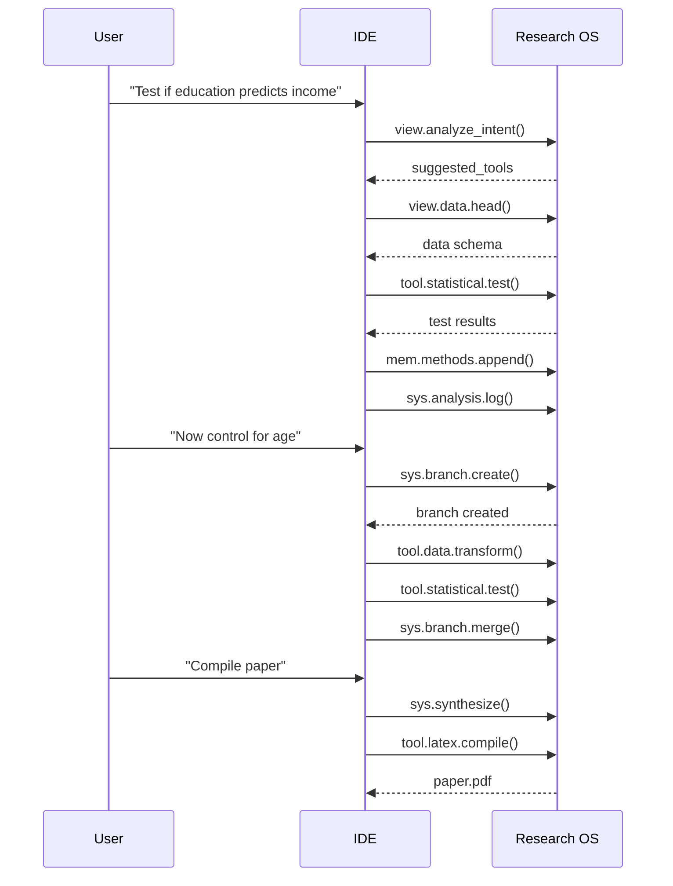

# AI Native Workflows

The IDE-driven research loop: how AI IDEs use Research OS tools to execute reproducible research.

---

## The IDE-Driven Loop

Research OS is not an autonomous agent. It's a tool server that provides the **hands**, **eyes**, and **memory** that your AI IDE uses to execute research. The IDE is the brain—it thinks, plans, and decides which tools to call.

```
┌─────────────────────────────────────────────────────────┐
│                    AI IDE (Brain)                        │
│  Cursor / Windsurf / Claude Desktop / VS Code           │
│  ┌─────────────────────────────────────────────────┐    │
│  │  1. User types: "Test whether education predicts income" │
│  │  2. IDE calls: view.analyze_intent(query="...")  │    │
│  │  3. IDE receives suggested tools:              │    │
│  │     - view.data.head (to inspect data)          │    │
│  │     - tool.statistical.test (to run test)       │    │
│  │  4. IDE calls tools in sequence                 │    │
│  │  5. IDE reads results, logs to methods.md        │    │
│  └─────────────────────────────────────────────────┘    │
└──────────────────────┬──────────────────────────────────┘
                       │ MCP Protocol (stdio JSON-RPC)
                       ▼
┌─────────────────────────────────────────────────────────┐
│              Research OS (Executor)                      │
│  ┌───────────────┐  ┌────────────────────────────────┐  │
│  │  Tool Router   │  │  State Ledger                  │  │
│  │  (server.py)   │  │  (.os_state/state_ledger.yaml) │  │
│  │                │  │  - current_branch              │  │
│  │  sys.*         │  │  - branches & statuses         │  │
│  │  tool.*        │  │  - checkpoint_history          │  │
│  │  view.*        │  │                                │  │
│  │  mem.*         │  │                                │  │
│  └───────┬───────┘  └────────────────────────────────┘  │
│          │                                                │
│  ┌───────▼────────────────────────────────────────────┐  │
│  │  Tool Implementations                              │  │
│  │  ┌──────────┐ ┌──────────┐ ┌──────────────────┐   │  │
│  │  │ Hands    │ │ Eyes     │ │ Memory           │   │  │
│  │  │ (tool.*) │ │ (view.*) │ │ (mem.*)          │   │  │
│  │  │          │ │          │ │                  │   │  │
│  │  │ latex    │ │ tree     │ │ methods.append   │   │  │
│  │  │ pubmed   │ │ data.head│ │ citation.add     │   │  │
│  │  │ ttest    │ │ figure   │ │ regenerate.intake│   │  │
│  │  │ figure   │ │          │ │ literature.index │   │  │
│  │  │ transform│ │          │ │ citations.generate│  │  │
│  │  │ dashboard│ │          │ │ checkpoint       │   │  │
│  │  └──────────┘ └──────────┘ └──────────────────┘   │  │
│  └────────────────────────────────────────────────────┘  │
└─────────────────────────────────────────────────────────┘
                       │
                       ▼
┌─────────────────────────────────────────────────────────┐
│                    Workspace (Filesystem)                │
│                                                          │
│  inputs/    workspace/    synthesis/    .os_state/      │
│  (immutable) (active)     (outputs)     (internal)      │
└─────────────────────────────────────────────────────────┘
```

---

## Typical Research Session

### Step 1: User Request

**User types in IDE chat:**
> "I have a CSV at `inputs/raw_data/survey.csv`. Test whether education level predicts income."

### Step 2: Intent Analysis

**IDE calls:**
```
view.analyze_intent(query="Test whether education level predicts income")
```

**Research OS returns:**
```json
{
  "intent": "hypothesis_testing",
  "suggested_tools": [
    "view.data.head",
    "tool.statistical.test",
    "mem.methods.append",
    "sys.analysis.log"
  ],
  "depth": "academic"
}
```

### Step 3: Data Inspection

**IDE calls:**
```
view.data.head(filepath="inputs/raw_data/survey.csv", n=5)
```

**Research OS returns:**
```json
{
  "shape": [500, 8],
  "columns": [
    {"name": "income", "dtype": "float64", "null_pct": 0.4},
    {"name": "education", "dtype": "int64", "null_pct": 0.0}
  ],
  "head": [...]
}
```

### Step 4: Statistical Test

**IDE calls:**
```
tool.statistical.test(
  filepath="inputs/raw_data/survey.csv",
  test_type="ttest",
  x_column="income",
  group_column="education"
)
```

**Research OS returns:**
```json
{
  "test_type": "ttest",
  "assumptions": {
    "normality_group_0": {"passed": true},
    "homogeneity": {"passed": true}
  },
  "results": {
    "test": "Welch t-test",
    "statistic": 7.824,
    "p_value": 0.0000012,
    "significant": true
  }
}
```

### Step 5: Log Methods

**IDE calls:**
```
mem.methods.append(
  method="Welch t-test",
  parameters="income ~ education, equal_var=False",
  tool="tool.statistical.test",
  citation="student1908"
)
```

### Step 6: Update Analysis Log

**IDE calls:**
```
sys.analysis.log(
  entry="Welch t-test: income ~ education, t=7.82, p<0.001, significant",
  step="01_hypothesis_test",
  status="complete"
)
```

This updates `workspace/analysis.md` and renders the Mermaid workflow diagram.

---

## Branching and Iteration

### Creating a New Experiment

**User types:**
> "That's significant. Now test if the effect holds after controlling for age."

**IDE calls:**
```
sys.branch.create(
  name="controlled_by_age",
  hypothesis="Education effect persists after age control",
  from_step="01_hypothesis_test"
)
```

**Research OS creates:**
```
workspace/02_controlled_by_age/
├── README.md
├── conclusions.md
├── data/
├── scripts/
└── outputs/
```

### Running in the New Branch

**IDE calls tools in the new branch:**
```
tool.data.transform(
  filepath="workspace/02_controlled_by_age/data/survey.csv",
  operations=[{"type": "normalize", "columns": ["age"]}]
)

tool.statistical.test(
  filepath="workspace/02_controlled_by_age/data/survey.csv",
  test_type="anova",
  x_column="income",
  group_column="education"
)
```

### Merging Findings

**User types:**
> "The controlled analysis confirms the finding. Merge it back."

**IDE calls:**
```
sys.branch.merge(
  source="02_controlled_by_age",
  target="main",
  message="Education effect confirmed after age control: F=12.4, p<0.001"
)
```

---

## Synthesis and Publication

### Compiling the Paper

**User types:**
> "I'm done. Compile the paper."

**IDE calls:**
```
sys.synthesize(
  project_name="Education and Income Analysis",
  formats=["pdf"]
)
```

**Research OS creates:**
```
synthesis/
├── abstract.md
├── paper.tex
├── references.bib
└── supplementary/
```

### Compiling LaTeX

**IDE calls:**
```
tool.latex.compile()
```

**Research OS returns:**
```json
{
  "pdf_path": "/path/to/project/synthesis/paper.pdf",
  "success": true
}
```

---

## Key Principles

### 1. IDE is the Brain, OS is the Body

- **IDE responsibilities:** Understand natural language, plan tool sequences, decide which tools to call, interpret results, present findings to user
- **OS responsibilities:** Execute tools, manage state, log actions, ensure reproducibility

### 2. Stateless Tool Execution

Each tool call is independent. The IDE maintains context, not Research OS. This makes the system:
- **Robust:** No hidden state between calls
- **Debuggable:** Every tool response is self-contained
- **Transparent:** All state is in files (analysis.md, methods.md, state_ledger.yaml)

### 3. Append-Only State Management

- `methods.md` is append-only—methods are never deleted
- `analysis.md` is a chronological log—entries are never removed
- `state_ledger.yaml` tracks all branches and checkpoints
- Checkpoints enable rollback to any prior state

### 4. Immutable Inputs

The `inputs/` directory is write-protected. All data processing happens in `workspace/`. This ensures:
- **Provenance:** Original data is never modified
- **Reproducibility:** You can always trace back to source files
- **Safety:** No accidental data corruption

---

## Tool Selection Patterns

### Pattern 1: Exploratory Analysis

```
view.data.head() → tool.figure.create() → sys.analysis.log()
```

### Pattern 2: Hypothesis Testing

```
view.data.head() → tool.statistical.test() → mem.methods.append() → sys.analysis.log()
```

### Pattern 3: Literature Review

```
tool.pubmed.search() → mem.citation.add() → mem.literature.index()
```

### Pattern 4: Data Preparation

```
tool.data.transform() → view.data.head() → tool.figure.create()
```

### Pattern 5: Branching Experiment

```
sys.checkpoint() → sys.branch.create() → [run analysis] → sys.branch.merge()
```

---

## Error Handling

### Tool Errors

If a tool fails, Research OS returns:
```json
{
  "status": "error",
  "data": {"error": "File not found: survey.csv"},
  "warnings": []
}
```

The IDE should:
1. Read the error message
2. Adjust the approach (e.g., check file path)
3. Retry with corrected parameters

### Assumption Failures

Statistical tools return assumption checks:
```json
{
  "assumptions": {
    "normality": {"passed": false, "p_value": 0.001}
  }
}
```

The IDE should:
1. Check if assumptions passed
2. If not, suggest alternative tests (e.g., non-parametric)
3. Call the appropriate tool

### Missing Dependencies

Tools return warnings for missing external deps:
```json
{
  "warnings": ["pdflatex not found — LaTeX compilation disabled"]
}
```

The IDE should inform the user and suggest installation.

---

## Best Practices for IDEs

### 1. Always Call `view.data.head` First

Before any analysis, inspect the data to understand:
- Shape (rows, columns)
- Column types
- Null percentages
- Sample values

### 2. Log Every Method

After every statistical test or data transformation, call `mem.methods.append()` to record:
- Method name
- Parameters used
- Citation (if applicable)
- Tool that executed it

### 3. Update Analysis Log

After each significant step, call `sys.analysis.log()` to:
- Record the step in the chronological log
- Update the Mermaid workflow diagram
- Track progress

### 4. Checkpoint Before Destructive Operations

Before data transformation or model training:
```
sys.checkpoint(checkpoint_id="before_transformation")
```

### 5. Use Branches for Experiments

Don't overwrite previous work. Create branches:
```
sys.branch.create(name="new_experiment", from_step="01_baseline")
```

### 6. Verify Assumptions

Statistical tools return assumption checks. Always verify:
- Normality (Shapiro-Wilk)
- Homogeneity (Levene)
- Expected frequencies (for chi-square)

If assumptions fail, use non-parametric alternatives.

---

## Example: Complete Research Loop


