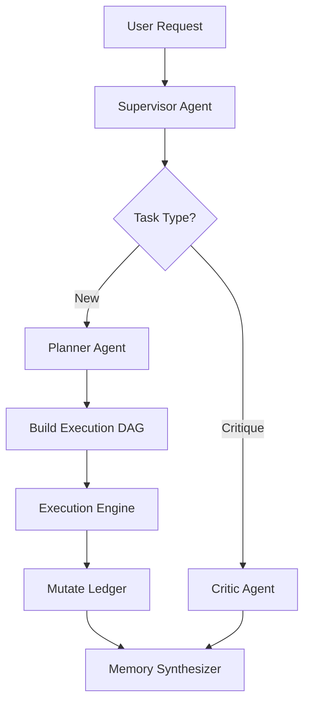

# AI-Native Workflows in Research Copilot

Research Copilot is built from the ground up for AI-native research workflows. Instead of manually invoking LLMs for single tasks, you orchestrate autonomous agents that plan, execute, critique, and document your research iteratively.

## Core Paradigms

### 1. Dynamic Replanning
The system doesn't execute fixed scripts. It uses a **SupervisorAgent** and a **CapabilityPlanner** to dynamically build and mutate an execution DAG based on your request and the current state of the project.

### 2. Autonomous Debate & Critique
The **CriticAgent** and **SkepticAgent** actively challenge findings. Before a hypothesis is accepted or a conclusion is published, it must survive internal peer-review. This prevents hallucinations and overclaiming.

### 3. State & Memory Compression
Instead of overflowing token limits with giant conversational histories, Research Copilot uses deterministic context sliding and semantic memory compression. It maintains a **Cognitive Tracker** that holds the active hypotheses, verified claims, open questions, and dead ends.

### 4. Interrupt & Resume
If an agent gets stuck, needs approval, or needs real-world data (like a wet-lab result), it suspends execution and pushes to an **Interrupt Stack**. You can answer the query and the agent will resume exactly where it left off.

## Example Workflow

