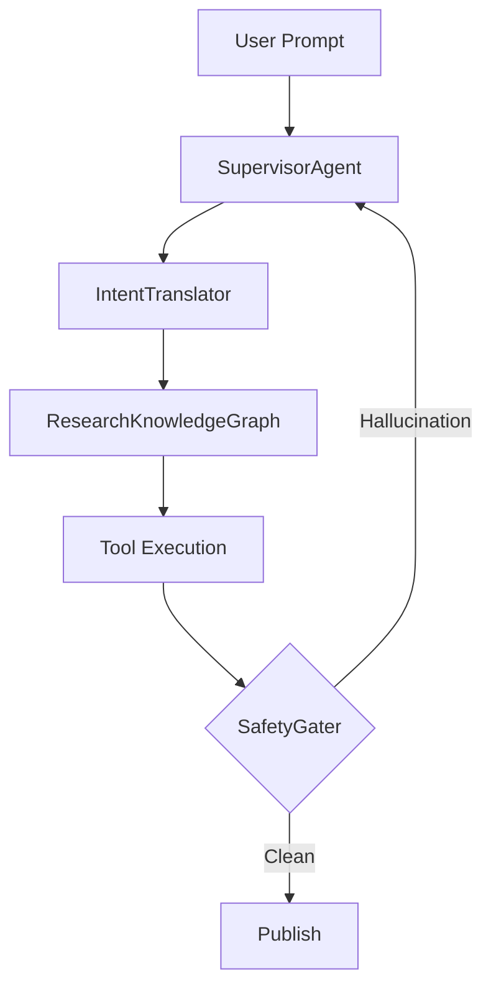

# AI Native Workflows

Research Copilot decomposes complex goals into Agentic DAG workflows.

```mermaid
graph TD
    A[User Prompt] --> B[SupervisorAgent]
    B --> C[IntentTranslator]
    C --> D[ResearchKnowledgeGraph]
    D --> E[Tool Execution]
    E --> F{SafetyGater}
    F -->|Hallucination| B
    F -->|Clean| G[Publish]
```
