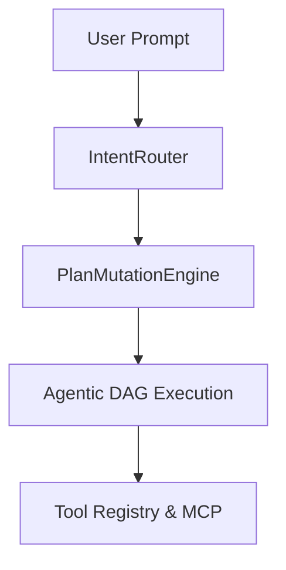

# Research OS Architecture Guide

Research OS models research as an **Agentic Directed Acyclic Graph (DAG)** running on the **Model Context Protocol (MCP)**. It dynamically adapts to user goals through a "zero-to-research" intake layer.

## Core Components
1. **MCP Server (`server.py`)**: The primary daemonized entry point. Exposes capabilities via JSON-RPC.
2. **Intent Router (`intent_router.py`)**: Bootstraps unstructured text into a rigorous intake schema.
3. **Execution Engine**:
   - `interrupt_engine.py`: Halts execution and saves state for human-in-the-loop or side tasks.
   - `side_task_manager.py`: Handles `StuckLoopException` and spawns isolated side tasks.
   - `plan_mutation_engine.py`: Dynamically computes DAG nodes based on intent.
4. **Cognitive Subsystem**:
   - `cognitive_tracker.py`: Maintains active hypotheses, claims, evidence, and tracks execution stuck loops.
   - `token_budget.py` & `prompt_compression.py`: Enforces memory tiers and performs rolling semantic distillation.
5. **Semantic State Ledger (`state_ledger.py`)**: The single source of truth for the entire pipeline run.

## Workflow

1. User invokes `research-os start --daemon`.
2. The query is routed to the `IntentRouter`, which builds a dynamic DAG intake schema.
3. The graph is executed. At each node, the state is serialized to the `StateLedger`.
4. High-risk tools (e.g., shell access) are gated by `ToolCapabilityCheck` requiring high confidence.
5. If hallucinations, compilation errors, or stuck loops occur, the `SafetyGater` or `SideTaskManager` routes back to recovery protocols to correct the issue.
