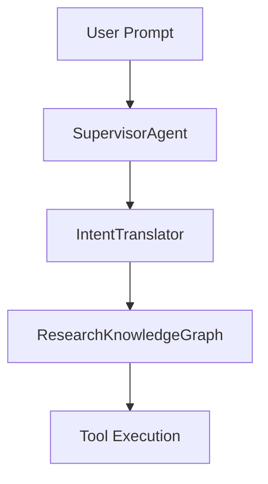

# Architecture Guide

Research Copilot models research as an **Agentic Directed Acyclic Graph (DAG)** running on the **Model Context Protocol (MCP)**.

## Core Components
1. **MCP Server (`server.py`)**: The primary entry point. Exposes tools and resources via JSON-RPC.
2. **Intent Router (`intent_router.py`)**: Analyzes queries and maps them to a minimal subset of the Research Knowledge Graph.
3. **Execution Engine**:
   - `interrupt_engine.py`: Halts execution and saves state for human-in-the-loop or side tasks.
   - `side_task_manager.py`: Spawns isolated side tasks without polluting the main context window.
4. **Semantic State Ledger (`state_ledger.py`)**: The single source of truth for the entire pipeline run.

## Workflow

1. User invokes `rcp start`.
2. The query is routed to the `IntentRouter`, which determines the required agents and skills.
3. The graph is executed. At each node, the state is serialized to the `StateLedger`.
4. If hallucinations or compilation errors occur, the `SafetyGater` routes back to the `ReflectionAgent` to correct the issue.
