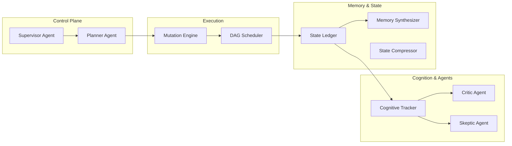

# Research Copilot Architecture

The system has transitioned from a rigid pipeline to a dynamic, autonomous OS.

## Core Subsystems

### 1. Agents Layer (`src/research_copilot/agents/`)
Contains the LLM personas (Supervisor, Critic, Skeptic) that steer the research.

### 2. Cognition Layer (`src/research_copilot/cognition/`)
Tracks hypotheses, claims, contradictions, and evidence. Maintains the epistemic state of the project.

### 3. Memory Layer (`src/research_copilot/memory/`)
Synthesizes episodic memory into semantic project context.

### 4. Planning & Execution (`src/research_copilot/planning/`, `src/research_copilot/execution/`)
Builds and executes the directed acyclic graph (DAG) of research tasks.

### 5. Prompts (`src/research_copilot/prompts/`)
Modular, compressed system prompts injected dynamically based on cognitive state.
