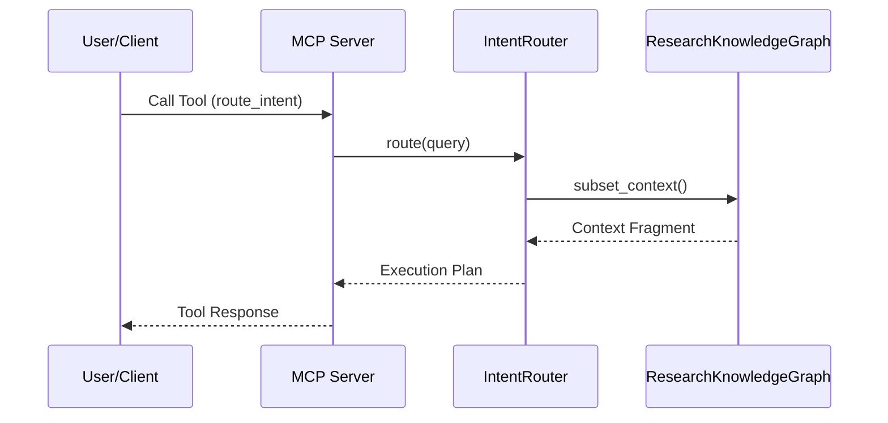

# MCP Integration

Research Copilot is fully MCP-compatible.

```mermaid
sequenceDiagram
    participant User/Client
    participant MCP Server
    participant IntentRouter
    participant ResearchKnowledgeGraph

    User/Client->>MCP Server: Call Tool (route_intent)
    MCP Server->>IntentRouter: route(query)
    IntentRouter->>ResearchKnowledgeGraph: subset_context()
    ResearchKnowledgeGraph-->>IntentRouter: Context Fragment
    IntentRouter-->>MCP Server: Execution Plan
    MCP Server-->>User/Client: Tool Response
```
