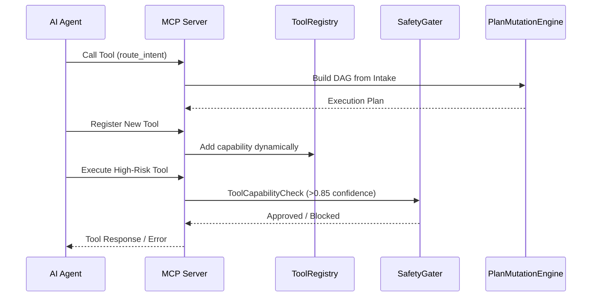

# MCP Integration

Research OS is built natively on the **Model Context Protocol (MCP)**, treating external AI clients and agents as first-class citizens. The MCP implementation provides a highly extensible and dynamic interface for execution and capability management.

## Dynamic Execution Workflow

Agents connect to the daemonized MCP server (`research-os start --daemon`) and execute tools via standard JSON-RPC over `stdio` or `HTTP`.

## AI-Driven Extensibility
By exposing the `ToolRegistry` directly via MCP, external AI instances can hot-plug newly authored tools into the OS runtime without restarting the daemon. This establishes an autonomous loop where the OS seamlessly expands its operational surface area in real-time.
